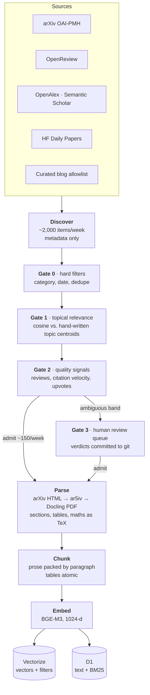
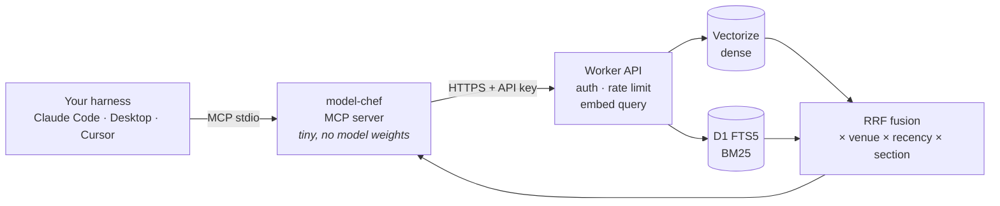

<div align="center">

# 🧑‍🍳 model-chef

**A curated research index for LLM post-training, served to your AI assistant over MCP.**

*RLHF · GRPO · DPO · PPO · reward modelling · verifiable rewards — full papers, tables included, every result cited.*

[](https://github.com/LaurenGallego/model-chef/actions/workflows/ci.yml)


</div>

> [!NOTE]
> **model-chef is in active development: phase 2 of 7.** The data contracts, ranking,
> arXiv parsing and chunking are built and tested. Discovery, triage, the hosted index and
> the installable MCP server are not yet available. Usage examples below describe the
> intended interface. See the [roadmap](#roadmap) for exactly what exists today.

---

## The idea

Ask a general-purpose assistant *"what KL coefficient do people use for GRPO on 7B
models?"* and you get a plausible answer from training data that is months stale, with
no way to check where it came from.

Post-training moves too fast for that. The useful knowledge sits in result tables,
ablations and hyperparameter appendices of papers published last month, and much of it
is not in any model's weights yet.

**model-chef is a specialist index that fixes that for one field.** It continuously
discovers new post-training work, admits only what passes a curation policy, parses the
*full text including tables*, and exposes it as an [MCP](https://modelcontextprotocol.io)
tool. Your assistant can then search it the same way it reads a file.

```
You:     What does Dr. GRPO change about the GRPO objective, and does it matter?

Claude:  ⏺ model-chef.search_recipes("Dr. GRPO objective length bias")

         Dr. GRPO removes two normalisation terms from GRPO: the 1/|oᵢ| response-length
         term and the per-group std term. Liu et al. argue these bias optimisation toward
         longer incorrect responses [1, §3.1]. Removing them keeps reasoning accuracy
         while improving token efficiency [1, §3.2]. Table 2 of the same paper shows
         several open-source PPO implementations carry the same length bias [1].

         [1] Liu et al., "Understanding R1-Zero-Like Training: A Critical Perspective",
             arXiv:2503.20783, 2025 · CC BY 4.0
```

The answer is written by *your* model. model-chef only supplies the retrieved passages
and their citations.

---

## What makes it different

<table>
<tr>
<td width="50%" valign="top">

### 📊 Tables are first-class
Papers are parsed from LaTeX-derived arXiv HTML rather than PDF, so result tables keep
their row and column structure. Each table is indexed as **one atomic chunk** with its
caption and section path, and is never split mid-row.

</td>
<td width="50%" valign="top">

### 🧭 Curated, and the curation is auditable
Candidates pass a cascade of cheap gates. Borderline papers go to a **human** review
queue, not an LLM judge, and every verdict is committed to git. "Curated" is a checkable
claim.

</td>
</tr>
<tr>
<td valign="top">

### 🔀 Hybrid search for exact tokens
Dense embeddings miss exact strings like `GRPO`, `Qwen3-32B` or `β=0.1`. model-chef fuses
dense retrieval with BM25 using reciprocal rank fusion, then weights by venue, recency
and section. Methods and results rank above related work; references never surface.

</td>
<td valign="top">

### ♻️ A self-cleaning index
A paper from yesterday has no citations yet. Promising recent work is admitted
**provisionally** on social and affiliation signals, then rescored at 90 days. Papers
that gained real traction stay, and the rest are evicted.

</td>
</tr>
<tr>
<td valign="top">

### 🔌 Works with any model
The server never calls an LLM provider. It returns cited passages, and generation
happens in whatever harness you already use: Claude, GPT or a local model, with no
per-provider code.

</td>
<td valign="top">

### 🏷️ Provenance on every result
Every chunk carries its title, authors, venue, peer-review tier, date, **per-document
licence** and parse depth. Attribution is always included, whatever the output policy.

</td>
</tr>
</table>

---

## How it works

Discovery is nearly free; deep parsing is expensive. The whole pipeline is a funnel
built around that 100:1 ratio.



**At query time:**



Ranking in one line:

```
score = RRF(dense, BM25) × tier_weight × recency_factor × section_weight
```

The recency factor has a floor, so a strong 2022 paper is not buried under a mediocre
blog post from last week. The full design, including cost modelling (≈ $6/month at 1M
chunks), is in **[docs/ARCHITECTURE.md](docs/ARCHITECTURE.md)**.

---

## Using it

> [!IMPORTANT]
> Not published yet. This section describes the planned interface (roadmap phase 6).

model-chef will ship as a small Python package that runs as a local MCP server and talks
to the hosted index. You need an API key; keys are issued manually for now.

**Claude Code**

```bash
claude mcp add model-chef --env MODEL_CHEF_API_KEY=your-key -- uvx model-chef
```

**Claude Desktop / Cursor** (`mcpServers` config)

```json
{
  "mcpServers": {
    "model-chef": {
      "command": "uvx",
      "args": ["model-chef"],
      "env": { "MODEL_CHEF_API_KEY": "your-key" }
    }
  }
}
```

### Tools

| Tool | What it does |
|---|---|
| `search_recipes(query, k=5, min_venue_tier=None)` | Hybrid search across the index. Returns ranked, cited passages. |
| `get_source(chunk_id)` | Full citation metadata for a result. |
| `list_recent_updates(since_date)` | What ingestion added recently, for transparency. |

### What a result looks like

Each result is a typed, validated object. Text length is enforced against the output
policy at construction, so full source text cannot leak by accident.

```json
{
  "chunk_id": "9f2c…",
  "chunk_kind": "table",
  "section_type": "analysis",
  "heading_path": ["Analysis on Base Models", "Qwen-2.5 Models Unlock the Best Performance When Discarding Template"],
  "text": "Table 1: Qwen2.5-Math models might be pretrained on concatenated question-answer text…",
  "truncated": true,
  "score": 0.0153,
  "citation": {
    "title": "Understanding R1-Zero-Like Training: A Critical Perspective",
    "url": "https://arxiv.org/abs/2503.20783",
    "venue_tier": "preprint",
    "license": "cc-by-4.0"
  }
}
```

| Variable | Purpose |
|---|---|
| `MODEL_CHEF_API_KEY` | Key for the model-chef API. **Not** an LLM provider key. |
| `MODEL_CHEF_API_URL` | Endpoint of the hosted index (defaults to the public one). |
| `MODEL_CHEF_OUTPUT_POLICY` | `snippet_only` (default) or `license_aware`. |

---

## Why the scope is narrow, on purpose

model-chef covers **post-training only**: not pretraining, not SFT, not ML in general.
That is a design decision, not an unfinished roadmap.

A retrieval index is only as good as its curation, and curation does not generalise.
The signals that pick out a strong RLHF paper (reviewer scores, citation velocity inside
a fast-moving subfield, whether the recipe is reproducible) are not the ones that pick
out a strong pretraining paper. A narrow index with a defensible admission policy beats
a broad one with none. Pretraining and SFT may come later as deliberate extensions.

---

## Roadmap

Each phase ends with something demoable.

- [x] **1 · Scaffold.** Packaging, CI, Pydantic contracts, provider-agnostic store protocols.
- [ ] **2 · arXiv ingestion and hybrid search** *(in progress)*
  - [x] Hybrid retrieval: RRF fusion and provenance-weighted ranking
  - [x] arXiv HTML parser: section typing, heading paths, atomic tables, TeX-preserving maths
  - [x] Chunker: paragraph-packed prose, idempotent chunk ids, provisional rescoring
  - [ ] arXiv discovery and hard filters (gate 0)
  - [ ] Topic centroids and relevance gate (gate 1)
  - [ ] Pipeline runner, Vectorize and D1 adapters, reconciliation
- [ ] **3 · Tables and section typing at scale**
- [ ] **4 · OpenReview and venue calendar.** Reviewer scores feed triage.
- [ ] **5 · Blogs, social signals, provisional admission and eviction**
- [ ] **6 · Worker API, auth and published package.** The point where others can use it.
- [ ] **7 · Structured results extraction.** Result tables become typed rows
      (`model`, `task`, `metric`, `value`, `config`), so *"what KL coefficient did people
      use for GRPO on 7B models"* gets a direct answer.

---

## Engineering

This is also a portfolio project, built to show engineering discipline rather than
feature count.

- **Contracts first.** Every module boundary is a frozen Pydantic model in
  [`schemas.py`](src/model_chef/schemas.py). Chunk ids are derived deterministically, so
  re-ingesting a paper upserts instead of duplicating, and the schema enforces it.
- **No vendor lock-in in ingestion.** Ingestion writes through `VectorStore` and
  `DocumentStore` protocols; only the serving layer knows about Cloudflare. Tests run
  against in-memory stores with no network.
- **Tested where it counts.** Ranking tests assert *orderings* ("peer-reviewed outranks a
  blog at equal relevance"), not magic numbers. Parsing is tested against a recorded,
  CC BY 4.0 arXiv page, which catches upstream markup drift.
- **Strict tooling.** `ruff` lint and format, `mypy --strict`, and `pytest` on every PR,
  with `structlog` in ingestion so a silently broken scrape six months from now can be
  diagnosed.
- **Polite by design.** Respects each source's robots.txt and rate limits (arXiv HTML
  asks for a 15 s crawl delay) and records licence per document.

```
src/model_chef/
├── schemas.py          Pydantic contracts: the file everything depends on
├── stores.py           VectorStore / DocumentStore protocols
├── config.py           settings and ranking weights
├── ingestion/
│   ├── parse/          arXiv HTML → ParsedDocument
│   └── chunk/          ParsedDocument → chunks
└── server/
    └── retrieval.py    hybrid search and ranking
```

### Development

```bash
git clone https://github.com/LaurenGallego/model-chef
cd model-chef
uv sync --group dev --extra ingest   # add --extra embed for local embeddings (pulls torch)
uv run pytest
uv run ruff check . && uv run mypy src tests
```

---

## Known limitations

- **Not usable yet.** The hosted index and the published package are phases away.
- **Freshness depends on ingest cadence:** daily discovery, weekly deep parse.
- **Coverage is tiered.** Papers before December 2023 often have no arXiv HTML and fall
  back to ar5iv, PDF parsing or abstract-only. Every chunk records its `text_depth`, so
  shallow coverage is visible rather than hidden.
- **Blog coverage is a small, hand-curated allowlist**, never open crawling.
- **Single-vendor hosting.** The index runs on Cloudflare. The exit is a new adapter plus a
  reindex, since the corpus can be rebuilt from source, but that is not zero effort.
- **Output policy is an open decision.** By default every result is truncated to a
  snippet with a citation. Whether permissively licensed sources should return full text
  is still undecided ([ARCHITECTURE.md §8](docs/ARCHITECTURE.md#8-output-policy--open-decision)).

---

## Licence and attribution

Code is MIT-licensed. Indexed content belongs to its authors: every result carries its
source, authors and licence, and model-chef never redistributes content beyond what each
source's licence allows. The test fixture under `tests/fixtures/arxiv_html/` is from
arXiv:2503.20783 (Liu et al., 2025) and is used under CC BY 4.0.
